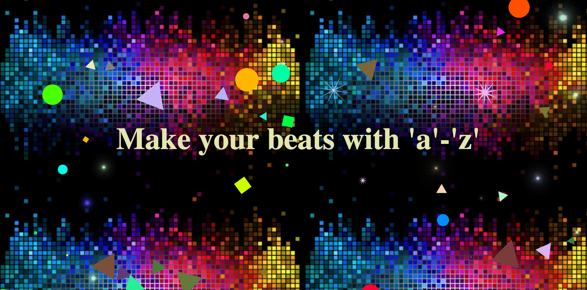

## Shape Beats

[Live Link](https://hellojohnito.github.io/Shape-Beats/)

    

### Background

Shape Beats is a simple game that allows users to create beats with the 'a' - 'z' keys on the keyboard. Shape Beats was implemented using paper.js to display the animations and howler.js for the sounds.
